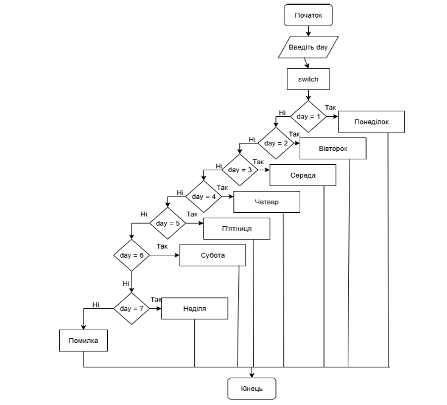

# Мої проєкти
**Опис:**  
Навчальний консольний застосунок для обчислення арифметичних виразів.
Програма приймає вхідні дані від користувача та виконує базові математичні операції.

**Використані технології:**  
- C  
- Стандартна бібліотека  
- Консольний інтерфейс

